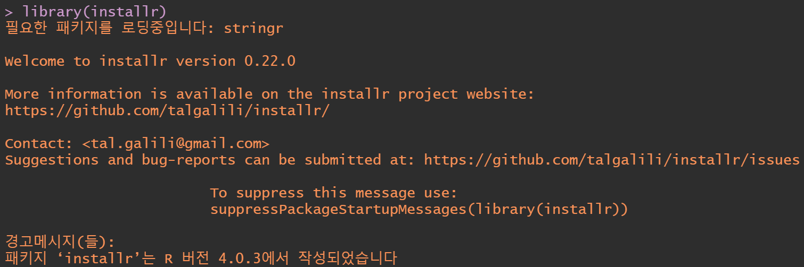
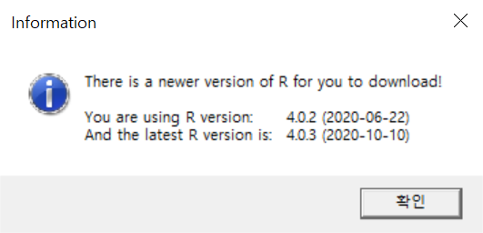
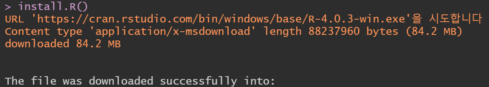
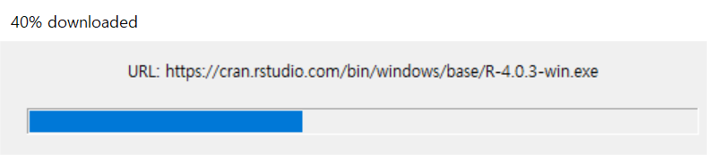
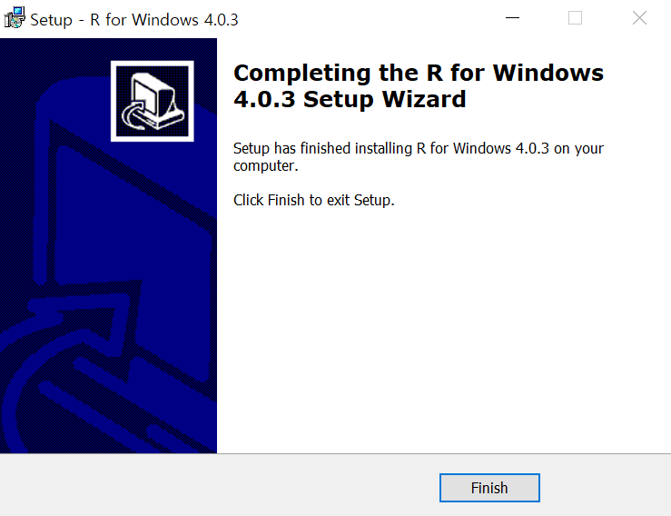
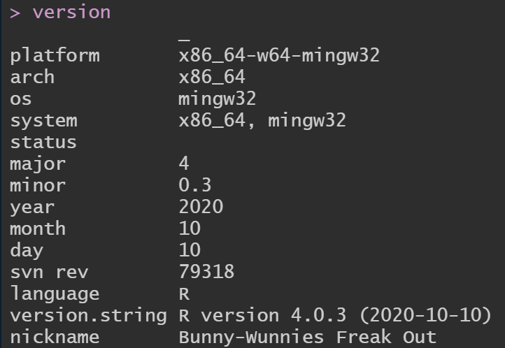
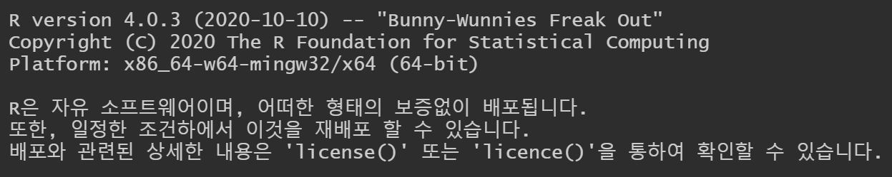

```{r setup, include=FALSE}
knitr::opts_chunk$set(echo = TRUE)
```

### R 최신 버전 업데이트 방법_명령어 이용

Step 1. installr 패키지를 설치하고 라이브러리 한다.
```
install.packages("installr")
library(installr)
```  

{width="500"}


Step 2. 업데이트 버전을 체크한다.
```
check.for.updates.R()
```  

{width="250"}

Step 3. R을 업데이트 한다.
```
install.R()
```  

{width="350"}  
console 창에 위 내용이 나타나고 설치 박스가 뜬다.  

{width="300"} 

필요한 항목만 체크하고 넘겨서 기다리면 설치가 끝난다.   
{width="350"}  

Step 4. R을 종료하고 다시 접속해 업데이트 됐는지 버전을 확인한다.
```
version
```
{width="400"}  

+ 추가  
물론, R 재접속하면 버전 정보가 뜨니, version 입력하지 않고도 확인할 수 있다.
{width="500"}  